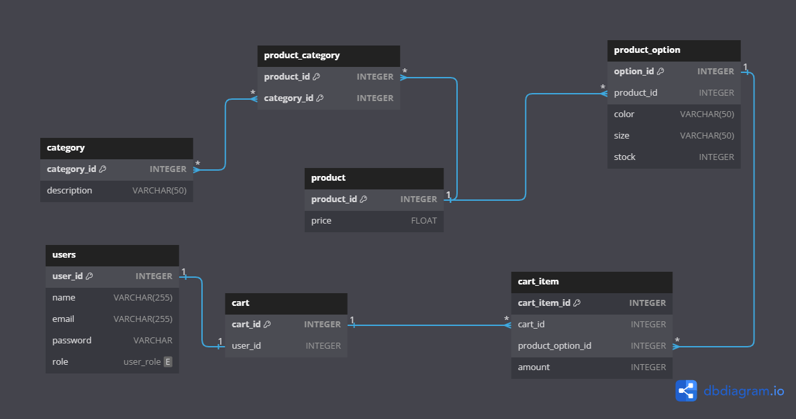

# Database documentation

This file contains a description of the PostgreSQL database created for this project.

To create the database you must run `npm run setup-db`

## Table of contents

- [Entity Relationship Diagram](#entity-relationship-diagram)
- [Tables](#tables)
    - [Users](#users)
        - [Enum: User Role](#enum-user-role)
    - [Product](#product)
    - [Category](#category)
    - [Product category](#product-category)
    - [Product option](#product-option)
    - [Cart](#cart)
    - [Cart_item](#cart-item)

## Entity Relationship Diagram

## Tables

### Users

Stores information about users.

| Key | Column Name | Data Type | description |
| --- | ----------- | --------- | ----------- |
| PK  | `user_id`   | int       |Primary key to identify each user |
|     | `name`      | varchar   | User's name |
|     | `email`     | varchar   | User's email |
|     | `password`  | varchar   | User's password (hashed) |
|     | `role`      | user_role | User's role |

#### Enum: user role

| `user_role` |
| --------- |
| admin     |
|customer   |

&nbsp;
### Product
 Stores information about products.

| Key | Column Name | Data Type | description |
| --- | ----------- | --------- | ----------- |
| PK | `product_id` | int | Primary key to identify each product |
|    | `price` | float | Product's price |

&nbsp;
### Category 

Stores information about categories.

| Key | Column Name | Data Type | description |
| --- | ----------- | --------- | ----------- |
| PK  | `category_id` | int | Primary key to identify each category |
|     | `description` | varchar | Category description |

&nbsp;
### Product Category

Describes the relationship between a product and its categories.
Multiple products can be related to multiple categories (many-to-many).

| Key | Column Name | Data Type | description |
| --- | ----------- | --------- | ----------- |
| PK, FK  | `product_id` | int | Product's id |
| PK, FK  | `category_id` | int | Category's id |

&nbsp;
### Product Option 

Describes the relationship between a product and its options.
One product can be related to multiple options (many-to-one).

| Key | Column Name | Data Type | description |
| --- | ----------- | --------- | ----------- |
| PK  | `option_id`  | int | Primary key to identify each option |
| FK  | `product_id` | int | References the id from the product table |
|     | `color`      | varchar | Color of the product |
|     | `size`       | varchar | Size of the product |
|     | `stock`  | int | Indicates how many units of the product are in stock |

&nbsp;
### Cart

Stores information about carts and to what user they are associated.
Each cart can only be related to one cart and each user can only be related to one cart. 

| Key | Column Name | Data Type | description |
| --- | ----------- | --------- | ----------- |
| PK | `cart_id` | int | Primary key to identify each cart |
| FK | `user_id` | int | References the id from the user table |

&nbsp;
### Cart Item

Describes the relationship between each cart and the product_options included in it.
One cart can have many product options and each product option can be in multiple carts (many-to-many).

| Key | Column Name | Data Type | description |
| --- | ----------- | --------- | ----------- |
| PK | `cart_item_id` | int | Primary key to identify each cart_item |
| FK | `cart_id` | int | References the id from the cart table |
| FK | `product_option_id` | int | References the id from the product_option table |
|    | `amount`  | Indicates the amount of the product_option included in the cart |
